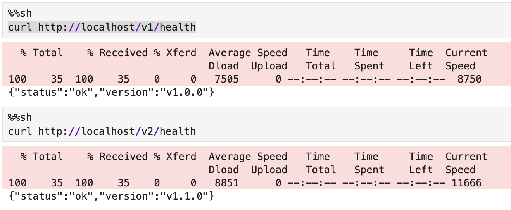

# Домашнее задание 7. Сборка конвейера CI/CD

Выполнила: Смирнова Анастасия РМ2

## Структура проекта
```text
├── .github/workflows/
│ ├── ci.yml # CI пайплайн (задание 1, 5)
│ └── deploy.yml # Деплой в GitHub Container Registry (задание 5)
├── ml_pipeline.py # Обучение модели RandomForest на Iris
├── canary_deployment_pipeline.py # Flask-сервис для Canary деплоя (нормальный)
├── canary_deployment_pipeline_bugged.py # Flask-сервис с багом (демонстрация Rollback)
├── docker-compose.yml # Canary: v1.0.0 + v1.1.0 + Nginx
├── docker-compose-bugged.yml # Демонстрация автоматического Rollback
├── Dockerfile # Docker-образ ML-сервиса
├── Dockerfile.bugged # Docker-образ для багнутой версии
├── nginx.conf # Балансировщик 90/10 + автооткат
├── ab_test_plan.py # A/B-тест (задание 4)
├── requirements.txt # Зависимости Python
├── README.md
├── screenshots/
├── doc/architecture/decisions/
│ └── 0001-canary-deployment.md # ADR: выбор стратегии деплоя (задание 2)
└── HW7_CICD_Смирнова_Анастасия.ipynb # Ноутбук с заметками по ходу решения
```

## Выполненные задания

### Задание 1. CI/CD-пайплайн (GitHub Actions)
- Создан `.github/workflows/ci.yml`
- При пуше автоматически: установка зависимостей → обучение модели → сохранение артефактов
- [Ссылка на выполненный CI](https://github.com/steishas/hw7-mlops-mipt-smirnova-anastasia/actions)

### Задание 2. ADR: выбор стратегии деплоя
- Рассмотрены: Blue-Green, Canary, Rolling, Shadow
- Выбрана стратегия **Canary Deployment**
- Обоснование: отсутствие обработки ошибок → минимальный риск при постепенном развёртывании
- [ADR-файл](doc/architecture/decisions/0001-canary-deployment.md)

### Задание 3. Реализация Canary Deployment

#### Нормальный режим (Canary 90/10)
- Две версии сервиса: v1.0.0 (стабильная) и v1.1.0 (новая)
- Nginx распределяет трафик 90/10 через `weight=9` и `weight=1`
- Обе версии отвечают на `/health` и `/predict`



#### Демонстрация автоматического Rollback
- Создана версия v1.2.0 с багом (`canary_deployment_pipeline_bugged.py`)
- `/health` намеренно возвращает ошибку 500
- Nginx настроен на автоматическое исключение нестабильного сервера:
  - `max_fails=2` — после 2 ошибок сервер помечается как недоступный
  - `fail_timeout=30s` — сервер исключается на 30 секунд
  - `proxy_next_upstream` — при ошибке запрос перенаправляется на стабильную версию
- Весь трафик автоматически уходит на v1.0.0

### Задание 4. A/B-тестирование
- Сравнение DummyClassifier (A) и RandomForest (B)
- Метрика: accuracy
- Статистический тест: точный тест Фишера
- Результат: модель B статистически значимо лучше (p < 0.05)

### Задание 5. Деплой через GitHub Actions
- Создан `.github/workflows/deploy.yml`
- Docker-образ собирается и пушится в GitHub Container Registry
- [Ссылка на выполненный Deploy](https://github.com/steishas/hw7-mlops-mipt-smirnova-anastasia/actions)

## Запуск

```bash
# Клонировать репозиторий
git clone https://github.com/steishas/hw7-mlops-mipt-smirnova-anastasia.git
cd hw7-mlops-mipt-smirnova-anastasia

# Установить зависимости
pip install -r requirements.txt
```

### Запуск ML-пайплайна

```bash
python ml_pipeline.py
```
Вывод: Точность accuracy: 1.00

### Запуск A/B-теста
```bash
python ab_test_plan.py
```
Сравнение DummyClassifier vs RandomForest, тест Фишера.

### Запуск Canary-деплоя (требуется Docker)

```bash
# Нормальный режим: v1.0.0 (90%) + v1.1.0 (10%)
docker-compose up -d --build

# Проверка health обеих версий
curl http://localhost/v1/health   # {"status":"ok","version":"v1.0.0"}
curl http://localhost/v2/health   # {"status":"ok","version":"v1.1.0"}

# Проверка распределения 90/10 (10 запросов)
for i in $(seq 1 10); do curl -s http://localhost/health; echo ""; done

# Проверка predict
curl -X POST http://localhost/predict \
  -H "Content-Type: application/json" \
  -d '{"features": [5.1, 3.5, 1.4, 0.2]}'

# Остановить
docker-compose down
```
### Демонстрация автоматического Rollback

#### Запустить с багнутой версией v1.2.0
```bash
docker-compose -f docker-compose-bugged.yml up -d --build
```

#### v2 health падает с ошибкой 500
```bash
curl http://localhost/v2/health
```

#### Все запросы через балансировщик уходят на v1.0.0 (автооткат)
```bash
for i in $(seq 1 10); do curl -s http://localhost/health; echo ""; done
```

#### Остановить
```bash
docker-compose -f docker-compose-bugged.yml down
```

# Выводы
`GitVerse` оказался не самым интуитивно понятным инструментом - пришлось разбираться с синтаксисом и настройками. `GitHub Actions`, напротив, показал себя стабильным и хорошо документированным: раннеры всегда доступны, интеграция с `GitHub Container Registry`.

Реализация `Canary-deployment` была интересной, но возникли сложности с отладкой механизма `Rollback`: `Nginx` не принимает weight=0, пришлось убирать нестабильный сервер из `upstream`. Планирование `A/B-теста` далось проще, так как можно было опереться на материалы семинара и адаптировать точный тест Фишера под нашу задачу.

Для полной воспроизводимости пайплайна важно сохранять зависимости (`requirements.txt`), обученную модель (`model.joblib`), метрики, гиперпараметры и фиксировать `random_state`. Это было реализовано в CI-пайплайне через `GitHub Actions`.

Секреты `CLOUD_TOKEN` и `MODEL_VERSION` не добавлялись — деплой ограничен `GitHub Container Registry`. При реальном облачном деплое секреты добавляются через Settings -> Secrets -> Actions.